# Token Ring AI Dependency Graph

## Overview

The Token Ring AI monorepo consists of 32 internal packages under `@tokenring-ai/*`, forming a modular ecosystem for AI
agents, tools, and integrations. Dependencies are hoisted via Yarn workspaces (configured in the root `package.json`),
reducing duplication and enabling efficient builds. Total unique internal dependencies: ~150 edges, with core packages
like `agent`, `ai-client`, `filesystem`, and `utility` serving as foundational hubs. External dependencies include AI
SDKs (e.g., `@ai-sdk/openai`), utilities (e.g., `zod`, `execa`), and providers (e.g., `@aws-sdk/client-s3`). No major
conflicts noted, but shared libs like `lodash` and `zod` are version-pinned to avoid mismatches.

## Package Dependencies Table

| Package          | Key Deps (Internal)                                                        | Key Deps (External)                                                                                                                                                                | Role                           |
|------------------|----------------------------------------------------------------------------|------------------------------------------------------------------------------------------------------------------------------------------------------------------------------------|--------------------------------|
| agent            | utility                                                                    | eventemitter3, glob-gitignore, uuid                                                                                                                                                | Core: Agent orchestration      |
| cdn              | agent                                                                      | -                                                                                                                                                                                  | Core: CDN abstraction          |
| s3               | agent                                                                      | @aws-sdk/client-s3                                                                                                                                                                 | Integration: AWS S3 FS/CDN     |
| sandbox          | agent                                                                      | zod                                                                                                                                                                                | Core: Sandbox interface        |
| mysql            | database                                                                   | mysql2                                                                                                                                                                             | Integration: MySQL DB          |
| wikipedia        | ai-client, agent                                                           | zod                                                                                                                                                                                | Integration: Wikipedia API     |
| websearch        | agent                                                                      | zod                                                                                                                                                                                | Core: Web search abstraction   |
| scraperapi       | ai-client, agent, websearch                                                | -                                                                                                                                                                                  | Integration: ScraperAPI        |
| serper           | ai-client, agent, websearch                                                | zod                                                                                                                                                                                | Integration: Serper.dev        |
| utility          | agent                                                                      | -                                                                                                                                                                                  | Core: Utilities                |
| testing          | agent, filesystem, queue                                                   | glob-gitignore                                                                                                                                                                     | Tools: Testing framework       |
| sqlite-storage   | ai-client, history                                                         | -                                                                                                                                                                                  | Integration: SQLite storage    |
| repo-map         | agent, filesystem                                                          | tree-sitter*, zod                                                                                                                                                                  | Tools: Repo mapping            |
| queue            | ai-client, agent, history                                                  | -                                                                                                                                                                                  | Core: Work queue               |
| memory           | agent, utility                                                             | -                                                                                                                                                                                  | Core: Memory management        |
| local-filesystem | agent, filesystem                                                          | chokidar, execa, fs-extra, glob*, glob-gitignore                                                                                                                                   | Integration: Local FS          |
| kubernetes       | agent                                                                      | @kubernetes/client-node                                                                                                                                                            | Integration: K8s resources     |
| javascript       | agent, filesystem                                                          | eslint, execa, jiti, jscodeshift                                                                                                                                                   | Tools: JS integration          |
| git              | ai-client, agent, filesystem, testing, utility                             | execa                                                                                                                                                                              | Tools: Git integration         |
| filesystem       | ai-client, agent                                                           | ignore, path-browserify                                                                                                                                                            | Core: FS abstraction           |
| file-index       | agent, filesystem                                                          | chokidar, commander, glob-gitignore, gpt-tokenizer, mysql2, sentencex, sqlite-vec, tree-sitter*                                                                                    | Tools: File indexing           |
| feedback         | agent, filesystem                                                          | esbuild*, express, marked, moment-timezone, open, react*, react-dom*                                                                                                               | Tools: Feedback UI             |
| docker           | agent, filesystem, sandbox, utility                                        | execa, glob-gitignore                                                                                                                                                              | Integration: Docker            |
| database         | agent                                                                      | -                                                                                                                                                                                  | Core: DB abstraction           |
| codebase         | filesystem                                                                 | -                                                                                                                                                                                  | Tools: Codebase service        |
| code-watch       | ai-client, agent, filesystem                                               | ignore                                                                                                                                                                             | Tools: Code watching           |
| cli              | agent, ai-client, inquirer-command-prompt, inquirer-tree-selector, utility | @dotenvx/dotenvx, @dqbd/tiktoken, @inquirer/prompts, @kubernetes/client-node, boxen, chalk, clipboardy, execa, ink*, next-auth, ora, react-syntax-highlighter, vite                | Tools: CLI interface           |
| chrome           | agent, websearch                                                           | puppeteer                                                                                                                                                                          | Integration: Chrome automation |
| aws              | filesystem                                                                 | @aws-sdk/client-s3, @aws-sdk/client-sts, node-fetch, zod                                                                                                                           | Integration: AWS auth/S3       |
| ai-client        | agent                                                                      | @ai-sdk/*, @kubernetes/client-node, @openrouter/ai-sdk-provider, ai, async, axios, lodash-es, next-auth, ollama-ai-provider, qwen-ai-provider, react-syntax-highlighter, vite, zod | Core: AI client & models       |

*Notes*: Internal deps are `@tokenring-ai/*` packages. External are third-party. Roles: Core (foundational), Tools (
utilities/services), Integrations (external APIs/DBs). Tree-sitter variants are language-specific.

## Integration Graph

```mermaid
graph TD
    agent[agent] --> utility[utility]
    cdn[cdn] --> agent
    s3[s3] --> agent
    s3 -.-> cdn
    s3 -.-> filesystem
    sandbox[sandbox] --> agent
    mysql[mysql] --> database[database]
    wikipedia[wikipedia] --> ai-client
    wikipedia --> agent
    websearch[websearch] --> agent
    scraperapi[scraperapi] --> ai-client
    scraperapi --> agent
    scraperapi --> websearch
    serper[serper] --> ai-client
    serper --> agent
    serper --> websearch
    testing[testing] --> agent
    testing --> filesystem
    testing --> queue
    sqlite-storage[sqlite-storage] --> ai-client
    sqlite-storage --> history[history]
    repo-map[repo-map] --> agent
    repo-map --> filesystem
    queue[queue] --> ai-client
    queue --> agent
    queue --> history
    memory[memory] --> agent
    memory --> utility
    local-filesystem[local-filesystem] --> agent
    local-filesystem --> filesystem
    kubernetes[kubernetes] --> agent
    javascript[javascript] --> agent
    javascript --> filesystem
    git[git] --> ai-client
    git --> agent
    git --> filesystem
    git --> testing
    git --> utility
    filesystem[filesystem] --> ai-client
    filesystem --> agent
    file-index[file-index] --> agent
    file-index --> filesystem
    feedback[feedback] --> agent
    feedback --> filesystem
    docker[docker] --> agent
    docker --> filesystem
    docker --> sandbox
    docker --> utility
    database[database] --> agent
    codebase[codebase] --> filesystem
    code-watch[code-watch] --> ai-client
    code-watch --> agent
    code-watch --> filesystem
    cli[cli] --> agent
    cli --> ai-client
    cli --> inquirer-command-prompt[inquirer-command-prompt]
    cli --> inquirer-tree-selector[inquirer-tree-selector]
    cli --> utility
    chrome[chrome] --> agent
    chrome --> websearch
    aws[aws] --> filesystem
    ai-client[ai-client] --> agent

    classDef core fill:#e1f5fe
    classDef tools fill:#f3e5f5
    classDef integrations fill:#e8f5e8
    class agent,ai-client,filesystem,utility,database,websearch,sandbox,queue,memory core
    class testing,repo-map,file-index,codebase,code-watch,javascript,git,docker,cli,chrome,feedback tools
    class s3,mysql,wikipedia,scraperapi,serper,sqlite-storage,kubernetes,aws,cdn,local-filesystem integrations
```

*Legend*: Solid edges = production deps; Dashed = peer deps. Core (blue), Tools (purple), Integrations (green).

## Hoisting & Conflicts

Yarn workspaces hoist common deps (e.g., `zod@4.0.17`, `execa@9.6.0`) to root `node_modules`, minimizing duplication.
Potential conflicts:

- Shared libs: `lodash` (v4.17.21 in multiple pkgs) – pinned to avoid version mismatches.
- AI SDKs: `@ai-sdk/*` versions aligned (e.g., ^2.0.x for OpenAI); audit for breaking changes.
- Tree-sitter: Language-specific (JS/Python/CPP) – no conflicts, but bundle size increases.
- No duplicate installs observed; run `yarn why <pkg>` to verify. Lockfile (`yarn.lock`) ensures reproducibility.

## Recommendations

- **Audit Regularly**: Use `npm audit` or `yarn audit` for vulnerabilities, especially in external deps like AWS SDK or
  Puppeteer.
- **Lockfile Management**: Commit `yarn.lock` to repo; regenerate with `yarn install` after dep changes.
- **Version Pinning**: Pin internal deps (e.g., `0.1.0`) to avoid breaking changes; use `nohoist` in workspaces for
  problematic pkgs.
- **Bundle Analysis**: Tools like `webpack-bundle-analyzer` for external deps; consider tree-shaking for Tree-sitter.
- **Migration Path**: For upgrades (e.g., AI SDK v3), update models/ in `ai-client` first, then propagate.